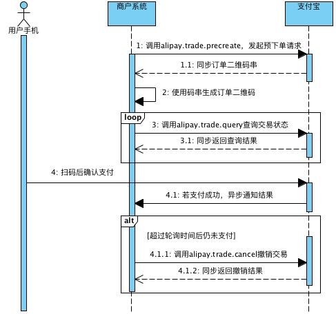

网上商城

## 用户模块
###横向越权、纵向越权安全漏洞
* 横向越权：攻击者尝试访问与他拥有相同权限的用户的资源
* 纵向越权：低级别攻击者尝试访问高级别用户的资源
用户模块接口文档地址：[用户模块](https://gitee.com/imooccode/happymmallwiki/wikis/%E9%97%A8%E6%88%B7_%E7%94%A8%E6%88%B7%E6%8E%A5%E5%8F%A3?sort_id=9917)  
### 用户表sql
```sql
CREATE TABLE `mmall_user` (
  `id` int(11) NOT NULL AUTO_INCREMENT COMMENT '用户表id',
  `username` varchar(50) NOT NULL COMMENT '用户名',
  `password` varchar(50) NOT NULL COMMENT '用户密码，MD5加密',
  `email` varchar(50) DEFAULT NULL,
  `phone` varchar(20) DEFAULT NULL,
  `question` varchar(100) DEFAULT NULL COMMENT '找回密码问题',
  `answer` varchar(100) DEFAULT NULL COMMENT '找回密码答案',
  `role` int(4) NOT NULL COMMENT '角色0-管理员,1-普通用户',
  `create_time` datetime NOT NULL COMMENT '创建时间',
  `update_time` datetime NOT NULL COMMENT '最后一次更新时间',
  PRIMARY KEY (`id`),
  UNIQUE KEY `user_name_unique` (`username`) USING BTREE
) ENGINE=InnoDB AUTO_INCREMENT=22 DEFAULT CHARSET=utf8;
```
## 分类管理模块
* 如何设计及封装无限层级的树状数据结构  
* 递归算法的设计思想  
* 如何处理复杂对象排重  
* 重写hashcode和equal的注意事项  
### 分类表sql
```sql
CREATE TABLE `mmall_category` (
  `id` int(11) NOT NULL AUTO_INCREMENT COMMENT '类别Id',
  `parent_id` int(11) DEFAULT NULL COMMENT '父类别id当id=0时说明是根节点,一级类别',
  `name` varchar(50) DEFAULT NULL COMMENT '类别名称',
  `status` tinyint(1) DEFAULT '1' COMMENT '类别状态1-正常,2-已废弃',
  `sort_order` int(4) DEFAULT NULL COMMENT '排序编号,同类展示顺序,数值相等则自然排序',
  `create_time` datetime DEFAULT NULL COMMENT '创建时间',
  `update_time` datetime DEFAULT NULL COMMENT '更新时间',
  PRIMARY KEY (`id`)
) ENGINE=InnoDB AUTO_INCREMENT=100032 DEFAULT CHARSET=utf8;
```
## 商品模块
* ftp服务对接  
* SpringMVC文件上传  
* 流读取Properties  
* 抽象POJO、BO、VO对象之间的转换关系及解决思路  
* joda-time快速入门  
* 静态块  
* Mybatis-PageHelper高效准确的分页及动态排序  
* Mybatis对List遍历的实现方法  
* Mybatis对where语句动态拼装的几个版本演变

### POJO、BO、VO  
对于复杂的业务逻辑  
从dao层拿到POJO对象，在service层转换成BO（business object）,传到Controller层再转成VO（view object）  
若业务并不复杂，POJO也是可以和VO直接通信的，此时的VO就是value-object  
### 商品sql
```sql
CREATE TABLE `mmall_product` (
  `id` int(11) NOT NULL AUTO_INCREMENT COMMENT '商品id',
  `category_id` int(11) NOT NULL COMMENT '分类id,对应mmall_category表的主键',
  `name` varchar(100) NOT NULL COMMENT '商品名称',
  `subtitle` varchar(200) DEFAULT NULL COMMENT '商品副标题',
  `main_image` varchar(500) DEFAULT NULL COMMENT '产品主图,url相对地址',
  `sub_images` text COMMENT '图片地址,json格式,扩展用',
  `detail` text COMMENT '商品详情',
  `price` decimal(20,2) NOT NULL COMMENT '价格,单位-元保留两位小数',
  `stock` int(11) NOT NULL COMMENT '库存数量',
  `status` int(6) DEFAULT '1' COMMENT '商品状态.1-在售 2-下架 3-删除',
  `create_time` datetime DEFAULT NULL COMMENT '创建时间',
  `update_time` datetime DEFAULT NULL COMMENT '更新时间',
  PRIMARY KEY (`id`)
) ENGINE=InnoDB AUTO_INCREMENT=30 DEFAULT CHARSET=utf8;
```  
## 购物车模块  
* 购物车模块的设计思想  
* 封装一个高复用购物车核心方法  
* 解决浮点型商业运算中丢失精度的问题
```sql
CREATE TABLE `mmall_cart` (
  `id` int(11) NOT NULL AUTO_INCREMENT,
  `user_id` int(11) NOT NULL,
  `product_id` int(11) DEFAULT NULL COMMENT '商品id',
  `quantity` int(11) DEFAULT NULL COMMENT '数量',
  `checked` int(11) DEFAULT NULL COMMENT '是否选择,1=已勾选,0=未勾选',
  `create_time` datetime DEFAULT NULL COMMENT '创建时间',
  `update_time` datetime DEFAULT NULL COMMENT '更新时间',
  PRIMARY KEY (`id`),
  KEY `user_id_index` (`user_id`) USING BTREE
) ENGINE=InnoDB AUTO_INCREMENT=146 DEFAULT CHARSET=utf8;
```
## 收货地址模块
* SpringMVC数据绑定中对象绑定  
* mybatis自动生成主键、配置和使用  
* 如何避免横向越权漏洞的巩固
### 收货地址表sql
```sql
CREATE TABLE `mmall_shipping` (
  `id` int(11) NOT NULL AUTO_INCREMENT,
  `user_id` int(11) DEFAULT NULL COMMENT '用户id',
  `receiver_name` varchar(20) DEFAULT NULL COMMENT '收货姓名',
  `receiver_phone` varchar(20) DEFAULT NULL COMMENT '收货固定电话',
  `receiver_mobile` varchar(20) DEFAULT NULL COMMENT '收货移动电话',
  `receiver_province` varchar(20) DEFAULT NULL COMMENT '省份',
  `receiver_city` varchar(20) DEFAULT NULL COMMENT '城市',
  `receiver_district` varchar(20) DEFAULT NULL COMMENT '区/县',
  `receiver_address` varchar(200) DEFAULT NULL COMMENT '详细地址',
  `receiver_zip` varchar(6) DEFAULT NULL COMMENT '邮编',
  `create_time` datetime DEFAULT NULL,
  `update_time` datetime DEFAULT NULL,
  PRIMARY KEY (`id`)
) ENGINE=InnoDB AUTO_INCREMENT=33 DEFAULT CHARSET=utf8;
```
## 支付模块
* 熟悉支付宝对接核心文档，调通支付宝支付功能官方Demo  
  > 1.[沙箱登录](https://openhome.alipay.com/platform/appDaily.htm?tab=tool)  
  > 2.[沙箱环境使用说明](https://docs.open.alipay.com/200/105311/)  
  > 3.[当面付产品介绍](https://docs.open.alipay.com/194)  
  > 4.[扫码支付接入指引](https://docs.open.alipay.com/194/106078/)  
  > 5.[当面付快速接入](https://docs.open.alipay.com/194/105170/)  
  > 6.[当面付接入必读](https://docs.open.alipay.com/194/105322/)  
  > 7.[当面付进阶功能](https://docs.open.alipay.com/194/105190/)  
  > 8.[当面付异步通知-仅用于扫码支付](https://docs.open.alipay.com/194/103296/)  
  > 9.[当面付SDK&Demo](https://docs.open.alipay.com/194/105201/)  
  > 10.[生成RSA密钥](https://docs.open.alipay.com/291/105971)  
  > 11.[线上创建应用说明](https://docs.open.alipay.com/200/105310)  
  
* 解析支付宝SDK对接源码  
* RSA1和RSA2验证签名及加解密  
* 避免支付宝重复通知和数据校验  
* natapp外网穿透和tomcat remote debug  
  > 1.保持远端代码版本和本地代码保持一致  
  > 2.执行sudo vim ${tomcat}/bin/catalina.sh进行编辑  
  > 3.添加如下配置，其中address为开放远程debug的端口号  
  > - CATALINA_OPTS="-server -Xdebug -Xnoagent -Djava.compiler=NONE - Xrunjdwp:transport=dt_socket,server=y,suspend=n,address=5005"  
  
  > 4.把开放远程dubug的端口加到防火墙配置中  
  > 5.及时关闭开放的debug端口  
  > 6.编辑sudo vim /etc/sysconfig/iptables  
  > 7.添加如下配置 -A INPUT -p tcp -m tcp --dport 5005 -j ACCEPT  
  > 8.:wq保存退出  
  > 9.重启防火墙sudo service iptables restart  
  
* 生成二维码，并持久化到图片服务器  
### 支付宝扫码支付功能对接  
* 一些重要的官方文档  
* 沙箱调试环境（测试账号）  
* 支付宝扫码支付主业务流程  
  
* 支付宝扫码支付流程  
  
* 支付宝扫码支付重要的字段  
  **关键入参：**  
    |参数名称|参数说明|  
    |:-:|:-|  
    |out_trade_no|商户订单号，需要保证不重复|  
    |total_amount|订单金额|
    |subject|订单标题|
    |store_id|商户门店编号|
    |timeout_express|交易超时时间|  
  **关键出参：**  
    |参数名称|参数说明|  
    |:-:|:-|  
    |qr_code|订单二维码（有效时间2小时）的内容，开发者需要自己使用工具根据内容生成二维码图片|  
  
  **重要字段：**  
    |参数|参数名称|类型|必填|描述|范例|  
    |:-:|:-:|:-:|:-:|:-:|:-:|  
    |trade_status|交易状态|String(32)|否|交易目前所处的状态|TRADE_CLOSED|  
    |total_amount|订单金额|Number(9,2)|否|本次交易支付的订单金额，单位为人民币（元）|20|  
    |buyer_pay_amount|付款金额|Number(9,2)|否|用户在交易中支付的金额|13.88|  
  **交易状态说明：**  
    |枚举名称|枚举说明|  
    |:-:|:-|  
    |WAIT_BUYER_PAY|交易创建，等待买家付款|  
    |TRADE_CLOSED|未付款交易超时关闭，或支付完成后全额退款|  
    |TRADE_SUCCESS|交易支付成功|  
    |TRADE_FINISHED|交易结束，不可退款|  
  **通知触发条件：**  
    |触发条件名|触发条件描述|触发条件默认值|  
    |:-:|:-|:-|  
    |TRADE_FINISHED|交易完成|false（不触发通知）|  
    |TRADE_SUCCESS|支付成功|true（触发通知）|  
    |WAIT_BUYER_PAY|交易创建|false（不触发通知）|  
    |TRADE_CLOSED|交易关闭|false（不触发通知）|  
  **支付渠道说明：**  
    |支付渠道代码|支付渠道|  
    |:-:|:-|  
    |ALIPAYACCOUNT|支付宝余额|  
* 支付宝扫码支付重要细节  
  > 1.主动轮询和回调的区别  
  > 2.避免单边账  
  > 3.同步请求的加签和验证签名  
  > 4.回调的验证（签名、金额、订单号、订单状态、交易状态、商户id）  
  > 5.过滤掉重复的通知  
  > 6.一定要验证并确保可接受的异步通知是支付宝发出的  
  
* 支付宝扫码支付对接技巧（外网联调）  
  * 回调请求的返回  
      ```sql
      程序执行完后必须打印输出“success”（不包含引号）。
      如果商户反馈给支付宝的字符不是success这7个字符，支付宝服务器会不断重发通知，直到超过24小时22分钟。
    一般情况下，25小时以内完成8次通知（通知的间隔频率一般是：4m,10m,10m,1h,2h,6h,15h）
      ```
  * 路由器设置开放本地到外网（不推荐）  
  * 外网远程dubug  
    - 1 保持远端代码版本和本地代码保持一致  
    - 2 及时关闭开放的dubug端口  
  * 内网穿透（ngrok、natapp、花生壳）  
* 支付宝扫码支付官方Demo调试   
